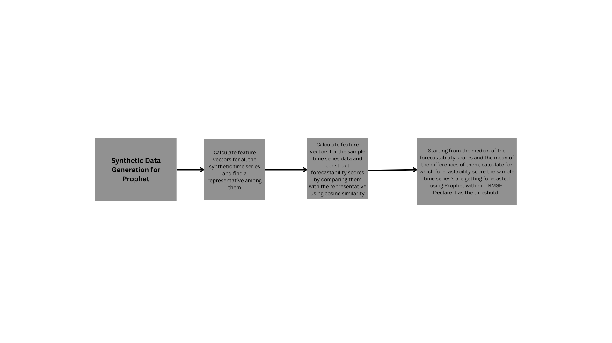
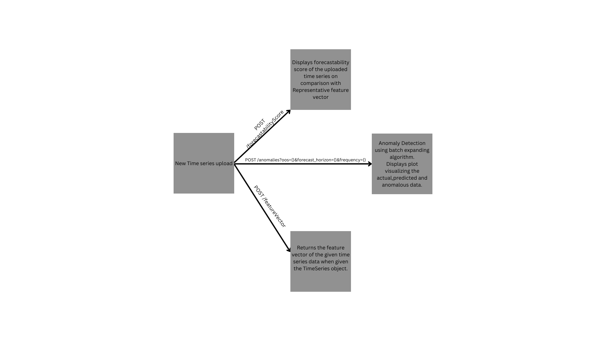

# DataGenie-Hackathon

### Checkpoint 1:
 - Did data preprocessing to replace NaN with mean of the point_value column.
 - Generated synthetic data(5000 time series , each of 500 rows) for Prophet model to extract features and constructed feature vectors for each time series to select a representative from it.
 - Finds the threshold for forecastability score, by iterating through different values of threshold and selecting the one which gives the least RMSE value when forecasted with the Sample Time Series data given.

Challenges Faced :
 - Deciding upon the threshold finding method.
 - Filtering the features to be extracted from the time series data.

### Checkpoint 2:
 - Given the time series dataframe,out of sample,forecast horizon and frequency as parameters to the anomaly detector function, it calculates the forecastability score for the time series given and 
if it's above the threshold, it forecasts the time series, checks for anomalies using the batch expanding window method and returns the forecasted values,MAPE and average time taken per batch.
 - Wherein out of sample(oos) is the size of data that is out of training, which is fixed as the maximum of the given oos and 90% of the total data, forecast horizon is the length of time for which forecasts are generated,
and frequency is the frequency of the time series data.
 - The function decides if the forecast generated is anomalous or not based on the yhat_lower and yhat_upper values provide by prophet model when forecasted. 
 - If the actual value is outside the range of yhat_lower and yhat_upper, then it is considered as an anomaly.

Challenges Faced :
 - Understanding the batch expanding window method.

### Checkpoint 3:

 - Added API endpoints namely :
      - POST /featureVector : Returns the feature vector of the given time series data when given the TimeSeries object.
      - POST /forecastabilityScore : Returns the forecastability score of the given time series data when given the TimeSeries object.
      - POST /anomalies?oos={}&forecast_horizon={}&frequency={} : Returns the forecasted values, MAPE, average time taken per batch for the given time series data and the anomalous points, when given the TimeSeries object.
      - GET /threshold : Returns the threshold value for the forecastability score.
 - Tested the API endpoints using Swagger UI.

Overall view :
- Checkpoint 1

- Checkpoint 2 & 3

- A basic UI has also been added using streamlit
  - The home page is similar to the Swagger UI, where the user can test the API endpoints on upload of time series as csv file.
  - The Components Plot page displays the components of the time series data.
  - The Anomalies Plot page displays the anomalies in the time series data.

